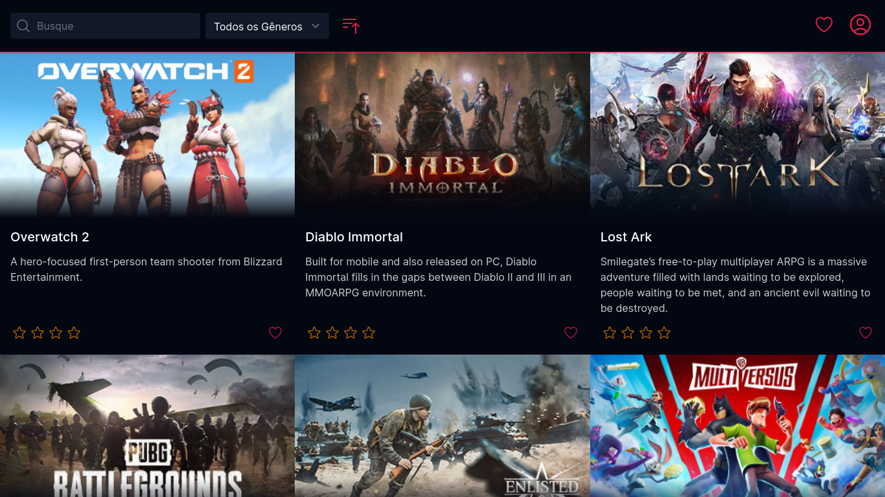

# Games

Projeto que disponibiliza informações sobre jogos, incluindo um mecanismo de pesquisa e opções de filtro por gênero.

## Screenshots




## Stack utilizada

TypeScript, React, Tailwind CSS, Vite, Axios

## Rodando localmente

Clone o projeto

```bash
  git clone https://github.com/KaykySousa/games-test.git
```

Entre no diretório do projeto

```bash
  cd games-test
```

Instale as dependências

```bash
  npm install
```

Inicie o servidor

```bash
  npm run dev
```
